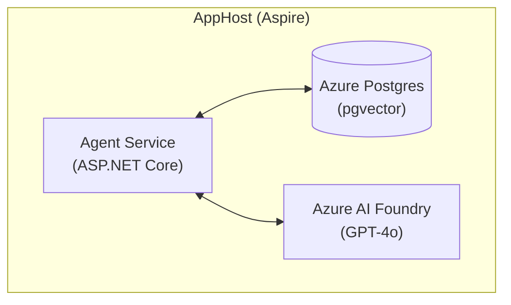

# Agent Evaluations Workshop

A hands-on workshop for learning how to evaluate AI agents using .NET, Microsoft.Extensions.AI, and Azure AI Foundry. This project demonstrates best practices for testing and evaluating AI agent behavior including retrieval accuracy, tool calling, task adherence, intent resolution, and prompt engineering.

## 🎯 Overview

This workshop teaches you how to build reliable AI agents by implementing structured evaluation patterns. You'll learn to:

- **Evaluate retrieval accuracy** - Ensure your agent retrieves the correct documents from a vector database
- **Validate tool calling** - Verify that agents call the right tools with correct arguments
- **Measure task adherence** - Confirm agents follow instructions and constraints
- **Assess intent resolution** - Test disambiguation of user queries
- **Iterate on prompts** - Use meta-prompt evaluation loops to improve agent behavior

## 🏗️ Architecture

The solution is built using **.NET Aspire** for distributed application orchestration:



### Projects

| Project | Description |
|---------|-------------|
| `AgentEvalsWorkshop` | Main agent service with retrieval, tools, and agent logic |
| `AgentEvalsWorkshop.AppHost` | .NET Aspire orchestrator for local development |
| `AgentEvalsWorkshop.ServiceDefaults` | Shared service configuration and extensions |
| `AgentEvalsWorkshop.Tests` | Evaluation tests using Microsoft.Extensions.AI.Evaluation |

## 📋 Prerequisites

- [.NET 10 SDK](https://dotnet.microsoft.com/download/dotnet/10.0) or later
- [Docker Desktop](https://www.docker.com/products/docker-desktop/) (for PostgreSQL with pgvector)
- [Azure CLI](https://docs.microsoft.com/cli/azure/install-azure-cli) (for Azure resources)
- An Azure subscription with access to Azure AI Foundry (optional - supports recordings for offline use)

## 🚀 Getting Started

### 1. Clone the Repository

```bash
git clone https://github.com/seiggy/agent-unit-testing.git
cd agent-unit-testing
```

### 2. Login to Azure CLI

```bash
az login
```

### 3. Start the Aspire Project

```bash
# Start the Aspire orchestrator
dotnet run --project src/AgentEvalsWorkshop.AppHost
```

At this point, you'll be asked to select a subscription and resource group name. Find your associated subscription, and create a resource group name of your choice (or accept the default).

Stop the server. We won't need it for now.

### 4. Run the Tests

```bash
# Run all evaluation tests
dotnet test tests/AgentEvalsWorkshop.Tests
```

## 📚 Workshop Exercises

The workshop is structured into three progressive user stories:

### US1: Retrieval & Tool Accuracy
**Goal:** Make the agent pass `RetrievalEvaluator` and `ToolCallAccuracyEvaluator`

- Configure proper retrieval with `top_k=3`
- Validate tool calls match expected signatures
- Use seeded PostgreSQL data with pgvector embeddings

📄 [Full Instructions](exercises/US1-retrieval-tool.md)

### US2: Task Adherence & Intent Resolution
**Goal:** Achieve ≥0.90 on `TaskAdherenceEvaluator` and `IntentResolutionEvaluator`

- Align agent responses to task briefs
- Handle ambiguous user inputs correctly
- Add disambiguation logic and rules

📄 [Full Instructions](exercises/US2-adherence-intent.md)

### US3: Meta-Prompt Improvement Loop
**Goal:** Improve baseline prompt to ≥0.80 evaluation score

- Iterate on prompt structure and instructions
- Track improvement trajectory across iterations
- Document prompt engineering decisions

📄 [Full Instructions](exercises/US3-meta-prompt.md)

## 🧪 Evaluation Framework

This workshop uses **Microsoft.Extensions.AI.Evaluation** for testing agent behavior:

```csharp
// Example evaluators
var relevanceEvaluator = new RelevanceEvaluator();
var coherenceEvaluator = new CoherenceEvaluator();
var wordCountEvaluator = new WordCountEvaluator();
```

### Available Evaluators

| Evaluator | Purpose |
|-----------|---------|
| `RelevanceEvaluator` | Measures response relevance to the query |
| `CoherenceEvaluator` | Assesses logical flow and clarity |
| `WordCountEvaluator` | Custom evaluator for response length constraints |
| `ToolCallAccuracyEvaluator` | Validates correct tool invocations |
| `TaskAdherenceEvaluator` | Checks compliance with task instructions |
| `IntentResolutionEvaluator` | Measures disambiguation accuracy |
| `MetaPromptEvaluator` | Evaluates prompt effectiveness |

## 📁 Project Structure

```
agent-unit-testing/
├── exercises/                    # Workshop exercise instructions
│   ├── US1-retrieval-tool.md
│   ├── US2-adherence-intent.md
│   └── US3-meta-prompt.md
├── infra/
│   ├── scripts/                  # Infrastructure scripts
│   └── seed/                     # Seed data for PostgreSQL
├── src/
│   ├── AgentEvalsWorkshop/       # Main agent service
│   │   ├── Agents/               # Agent implementations
│   │   ├── Retrieval/            # Vector retrieval logic
│   │   └── Tools/                # Agent tools
│   ├── AgentEvalsWorkshop.AppHost/        # Aspire orchestrator
│   └── AgentEvalsWorkshop.ServiceDefaults/ # Shared configuration
├── tests/
│   └── AgentEvalsWorkshop.Tests/ # Evaluation tests
└── TestResults/                  # Test output and reports
```

## 🔧 Configuration

### appsettings.json

The application uses standard ASP.NET Core configuration. Key settings:

```json
{
  "Logging": {
    "LogLevel": {
      "Default": "Information",
      "Microsoft.AspNetCore": "Warning"
    }
  }
}
```

## 🤝 Contributing

1. Fork the repository
2. Create a feature branch (`git checkout -b feature/amazing-feature`)
3. Commit your changes (`git commit -m 'Add amazing feature'`)
4. Push to the branch (`git push origin feature/amazing-feature`)
5. Open a Pull Request

## 📖 Resources

- [Microsoft.Extensions.AI Documentation](https://learn.microsoft.com/dotnet/ai/)
- [.NET Aspire Documentation](https://learn.microsoft.com/dotnet/aspire/)
- [Azure AI Foundry](https://learn.microsoft.com/azure/ai-studio/)
- [pgvector Extension](https://github.com/pgvector/pgvector)

## 📄 License

This project is licensed under the MIT License - see the [LICENSE](LICENSE) file for details.
