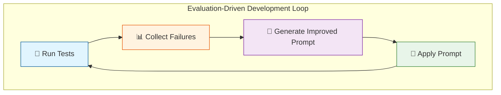

# Exercise: Meta-Prompt Improvement with Evaluation-Driven Development

## Goal
Build a **PromptImprovementGenerator** class that uses AI to analyze test failures and automatically suggest improved system prompts. You will use this tool to iteratively improve the **QuizGameAgent** until it passes all evaluation tests.

## Learning Objectives
- Understand how to use **LLM-as-a-judge** to analyze prompt failures
- Learn the **evaluation-driven development** workflow for improving AI agents
- Build a reusable tool for automated prompt engineering
- Practice iterative prompt improvement guided by test results

## Prerequisites
- Exercises US1-US4 completed successfully
- Aspire AppHost configured and running
- Solution open in Visual Studio 2026 or VS Code
- Azure Foundry endpoint configured in user secrets or environment variables

## What You're Given

You have been provided with:

| Component | Location | Purpose |
|-----------|----------|---------|
| **QuizGameAgent** | `src/AgentEvalsWorkshop/Agents/QuizGameAgent.cs` | Agent with tools but minimal instructions |
| **QuizGameAgentTests** | `tests/AgentEvalsWorkshop.Tests/QuizGameAgentTests.cs` | Unit tests that validate agent behavior |
| **QuizGameRulesEvaluator** | `tests/.../Helpers/QuizGameRulesEvaluator.cs` | Custom evaluator that scores against 6 rules |

## The Challenge

The QuizGameAgent currently has a **minimal system prompt**:

```csharp
private const string startingInstructions = """
    You are a quiz game agent.
    """;
```

This prompt is insufficient—the agent has tools but no guidance on when or how to use them. **Your mission**: build a `PromptImprovementGenerator` that analyzes test failures and suggests improved prompts until all tests pass.

---

## The Quiz Game Rules

The agent must follow these rules (defined in `QuizGameRulesEvaluator`):

| Rule | Description |
|------|-------------|
| **Rule 1** | When a user asks to start a game, generate exactly 10 trivia questions using `CreateQuizQuestions` |
| **Rule 2** | If the user asks for a specific category, generate ALL questions from that category |
| **Rule 3** | After creating questions, immediately retrieve and ask the first question using `GetCurrentQuestion` |
| **Rule 4** | When the user answers, compare to correct answer and call `ScoreQuestion` to record result |
| **Rule 5** | After scoring, use `MoveToNextQuestion` and `GetCurrentQuestion` to present next question |
| **Rule 6** | When all questions are answered, use `GenerateScoreboard` to create an HTML scoreboard |

---

# Part 1: Understand the Existing Components

## Examine the QuizGameAgent

1. [ ] Open **src/AgentEvalsWorkshop/Agents/QuizGameAgent.cs**
1. [ ] Review the available tools:

| Tool | Purpose |
|------|---------|
| `CreateQuizQuestions` | Creates a set of trivia questions for a session |
| `GetCurrentQuestion` | Gets the current question (without the answer) |
| `ScoreQuestion` | Records whether the user's answer was correct |
| `MoveToNextQuestion` | Advances to the next question |
| `GetQuizProgress` | Gets current score and progress |
| `GenerateScoreboard` | Creates an HTML scoreboard |

1. [ ] Note that `BuildQuizGameAgent` takes an `instructions` parameter:

```csharp
public static AIAgent BuildQuizGameAgent(IChatClient chatClient, string instructions)
{
    return chatClient.CreateAIAgent(
        instructions: instructions,
        name: "QuizMaster",
        tools: GetToolDefinitions()
    );
}
```

## Examine the QuizGameRulesEvaluator

1. [ ] Open **tests/AgentEvalsWorkshop.Tests/Helpers/QuizGameRulesEvaluator.cs**
1. [ ] Review the `GameRules` static property that defines the 6 rules:

```csharp
public static string GameRules => """
    The Quiz Game Agent must follow these rules:

    RULE 1 - Start Game: When a user asks to start a game, generate exactly 10 trivia questions...
    RULE 2 - Category Support: If the user asks for a specific category...
    RULE 3 - Ask First Question: After creating questions, immediately retrieve and ask the first question...
    RULE 4 - Score Answers: When the user provides an answer, compare and call ScoreQuestion...
    RULE 5 - Progress Through Questions: After scoring, use MoveToNextQuestion...
    RULE 6 - Generate Scoreboard: When all questions answered, use GenerateScoreboard...
    """;
```

1. [ ] Note the two metrics returned by the evaluator:
   - `QuizGameRulesMetricName` - Overall adherence score (1-5)
   - `QuizGameRuleViolationsMetricName` - List of specific rule violations

## Run the Baseline Tests

1. [ ] Run the tests with the minimal prompt:

	```Powershell
	dotnet test tests/AgentEvalsWorkshop.Tests --filter "TestCategory=AgentValidation"
	```

2. [ ] **Expected Result**: Some or all Tests will **fail** because the agent lacks proper instructions

---

# Part 2: Create the PromptImprovementGenerator

Your task is to create a class that:
1. Takes the current instructions and test results
2. Analyzes the failures using an LLM
3. Returns an improved prompt with targeted fixes

## Create the File Structure

1. [ ] Open the file file **PromptImprovementGenerator.cs** in **tests/AgentEvalsWorkshop.Tests/Helpers/**

1. [ ] Note the existing class skeleton:

```csharp
using Microsoft.Extensions.AI;
using System.Text;

namespace Microsoft.Extensions.AI.Evaluation.Quality;

/// <summary>
/// Generates improved agent instructions based on evaluation results.
/// </summary>
public sealed class PromptImprovementGenerator
{
    private readonly IChatClient _chatClient;

    public PromptImprovementGenerator(IChatClient chatClient)
    {
        _chatClient = chatClient;
    }

    // TODO: Implement GenerateImprovedPromptAsync
}
```

## Review the Provided Data Models

The following record types are provided for you in **PromptImprovementGenerator.cs**. Take a moment to understand what each one represents:

| Record | Purpose |
|--------|---------|
| `TestEvaluationResult` | Captures the result of running one test scenario (pass/fail, violations, response) |
| `PromptImprovementResult` | The output from your generator (success, improved prompt, explanation, fixes) |
| `PromptImprovementResponse` | Structured output format for the LLM to return (used with `GetResponseAsync<T>`) |
| `TargetedFix` | A specific issue/fix pair explaining what was changed |

<details>
<summary>💡 View Data Model Definitions</summary>

```csharp
/// <summary>
/// Result of a single test evaluation for prompt improvement analysis.
/// </summary>
public record TestEvaluationResult(
    string TestName,
    bool Passed,
    string UserInput,
    string AgentResponse,
    IReadOnlyList<string> Violations,
    string? FailureReason
);

/// <summary>
/// Result of prompt improvement generation.
/// </summary>
public record PromptImprovementResult(
    bool Success,
    string ImprovedPrompt,
    string Explanation,
    IReadOnlyList<TargetedFix> TargetedFixes
);

/// <summary>
/// Response structure for prompt improvement (used for structured output).
/// </summary>
public record PromptImprovementResponse(
    string ImprovedPrompt,
    string Explanation,
    TargetedFix[] TargetedFixes
);

/// <summary>
/// A specific fix applied to the prompt.
/// </summary>
public record TargetedFix(
    string Issue,
    string Fix
);
```

</details>

> [!knowledge] Why Separate Result and Response Types?
> 
> - `PromptImprovementResponse` is the **LLM's output format** — it uses arrays for JSON serialization
> - `PromptImprovementResult` is the **method's return type** — it uses `IReadOnlyList<T>` for better API design
> - This separation keeps the LLM contract simple while providing a clean API to consumers

## Implement the Main Method

1. [ ] Implement `GenerateImprovedPromptAsync`:

<details>
<summary>💡 Show Method Signature</summary>

```csharp
/// <summary>
/// Generates an improved prompt based on the current instructions and evaluation failures.
/// </summary>
/// <param name="currentInstructions">The current agent instructions.</param>
/// <param name="evaluationResults">Results from running evaluation tests.</param>
/// <param name="gameRules">The rules the agent should follow.</param>
/// <param name="cancellationToken">Cancellation token.</param>
/// <returns>A suggested improved prompt.</returns>
public async Task<PromptImprovementResult> GenerateImprovedPromptAsync(
    string currentInstructions,
    IEnumerable<TestEvaluationResult> evaluationResults,
    string gameRules,
    CancellationToken cancellationToken = default)
{
    // TODO: Build the improvement prompt
    // TODO: Call the LLM with structured output
    // TODO: Return the result
}
```

</details>

## Build the Improvement Prompt

The `BuildImprovementPrompt` method constructs the request we send to the LLM. This is where the "meta" in "meta-prompt" comes in—we're writing a prompt that asks an LLM to improve another prompt!

### Step 2.1: Understand What the LLM Needs

For the LLM to suggest meaningful improvements, it needs:

| Input | Purpose |
|-------|---------|
| **Current Instructions** | The prompt that's currently failing |
| **Game Rules** | What the agent *should* be doing |
| **Test Results** | Evidence of what went wrong |

> [!knowledge] Why Include All This Context?
> 
> The LLM acts as a "prompt engineer" that diagnoses failures. Without seeing the rules, it can't know what's expected. Without the test results, it can't know what's broken. Without the current prompt, it can't know what to improve.

### Step 2.2: Create the Method Signature

1. [ ] Add the `BuildImprovementPrompt` helper method after `GenerateImprovedPromptAsync`:

```csharp
private static List<ChatMessage> BuildImprovementPrompt(
    string currentInstructions,
    IEnumerable<TestEvaluationResult> evaluationResults,
    string gameRules)
{
    // TODO: Format test results
    // TODO: Build the meta-prompt
    // TODO: Return as ChatMessage list
}
```

### Step 2.3: Format the Test Results

The test results need to be formatted in a way the LLM can understand. Each result should clearly show:
- Test name and status (pass/fail)
- What the user said
- What the agent responded
- Any rule violations detected

1. [ ] Add code to iterate through results and build a formatted string:

```csharp
var resultsBuilder = new StringBuilder();
foreach (var testResult in evaluationResults)
{
    resultsBuilder.AppendLine($"## Test: {testResult.TestName}");
    resultsBuilder.AppendLine($"Status: {(testResult.Passed ? "✅ PASSED" : "❌ FAILED")}");
    resultsBuilder.AppendLine($"User Input: {testResult.UserInput}");
    resultsBuilder.AppendLine($"Agent Response: {testResult.AgentResponse}");
    
    if (testResult.Violations.Any())
    {
        resultsBuilder.AppendLine("Violations:");
        foreach (var violation in testResult.Violations)
        {
            resultsBuilder.AppendLine($"  - {violation}");
        }
    }
    
    if (!string.IsNullOrEmpty(testResult.FailureReason))
    {
        resultsBuilder.AppendLine($"Failure Reason: {testResult.FailureReason}");
    }
    
    resultsBuilder.AppendLine();
}
```

### Step 2.4: Construct the Meta-Prompt

Now build the actual prompt that instructs the LLM how to improve the agent's instructions. This prompt has several key sections:

| Section | Purpose |
|---------|---------|
| **Role** | Establish the LLM as an expert prompt engineer |
| **Current Instructions** | Show what's not working |
| **Rules** | Define success criteria |
| **Test Results** | Provide evidence of failures |
| **Task** | Explain exactly what output we need |
| **Format** | Specify JSON structure for structured output |

1. [ ] Add the meta-prompt template using string interpolation:

```csharp
var prompt = $$"""
    You are an expert prompt engineer. Your task is to improve an AI agent's system prompt 
    based on evaluation test results that show where the agent is failing to follow the rules.

    ## Current Agent Instructions
    ```
    {{currentInstructions}}
    ```

    ## Rules the Agent Must Follow
    {{gameRules}}

    ## Evaluation Test Results
    {{resultsBuilder}}

    ## Your Task
    Analyze the failures and create an improved system prompt that will help the agent 
    pass all the tests. The improved prompt should:

    1. Be clear and specific about WHEN to use each tool
    2. Include explicit step-by-step instructions for each scenario
    3. Address each failure by adding the missing instruction
    4. Keep the prompt concise but complete
    5. Use formatting (headers, numbered lists) for clarity

    Respond in this JSON format:
    {
        "improvedPrompt": "The complete new system prompt...",
        "explanation": "Brief explanation of what was changed and why",
        "targetedFixes": [
            { "issue": "Agent didn't ask first question", "fix": "Added step to explicitly get and ask first question" },
            ...
        ]
    }

    IMPORTANT: The improvedPrompt should be a complete, ready-to-use system prompt, not a diff or partial update.
    """;
```

> [!tip] Why Use `$$` and `{{}}` Syntax?
> 
> The double-dollar (`$$`) prefix enables raw string interpolation where curly braces are doubled. This is perfect here because our prompt contains JSON examples with `{}` that we don't want to interpolate, while `{{currentInstructions}}` gets replaced with actual values.

### Step 2.5: Return as ChatMessage

1. [ ] Complete the method by returning the prompt as a list of chat messages:

```csharp
return [new ChatMessage(ChatRole.User, prompt)];
```

<details>
<summary>💡 Show Complete BuildImprovementPrompt Implementation</summary>

```csharp
private static List<ChatMessage> BuildImprovementPrompt(
    string currentInstructions,
    IEnumerable<TestEvaluationResult> evaluationResults,
    string gameRules)
{
    var resultsBuilder = new StringBuilder();
    foreach (var testResult in evaluationResults)
    {
        resultsBuilder.AppendLine($"## Test: {testResult.TestName}");
        resultsBuilder.AppendLine($"Status: {(testResult.Passed ? "✅ PASSED" : "❌ FAILED")}");
        resultsBuilder.AppendLine($"User Input: {testResult.UserInput}");
        resultsBuilder.AppendLine($"Agent Response: {testResult.AgentResponse}");
        
        if (testResult.Violations.Any())
        {
            resultsBuilder.AppendLine("Violations:");
            foreach (var violation in testResult.Violations)
            {
                resultsBuilder.AppendLine($"  - {violation}");
            }
        }
        
        if (!string.IsNullOrEmpty(testResult.FailureReason))
        {
            resultsBuilder.AppendLine($"Failure Reason: {testResult.FailureReason}");
        }
        
        resultsBuilder.AppendLine();
    }

    var prompt = $$"""
        You are an expert prompt engineer. Your task is to improve an AI agent's system prompt 
        based on evaluation test results that show where the agent is failing to follow the rules.

        ## Current Agent Instructions
        ```
        {{currentInstructions}}
        ```

        ## Rules the Agent Must Follow
        {{gameRules}}

        ## Evaluation Test Results
        {{resultsBuilder}}

        ## Your Task
        Analyze the failures and create an improved system prompt that will help the agent 
        pass all the tests. The improved prompt should:

        1. Be clear and specific about WHEN to use each tool
        2. Include explicit step-by-step instructions for each scenario
        3. Address each failure by adding the missing instruction
        4. Keep the prompt concise but complete
        5. Use formatting (headers, numbered lists) for clarity

        Respond in this JSON format:
        {
            "improvedPrompt": "The complete new system prompt...",
            "explanation": "Brief explanation of what was changed and why",
            "targetedFixes": [
                { "issue": "Agent didn't ask first question", "fix": "Added step to explicitly get and ask first question" },
                ...
            ]
        }

        IMPORTANT: The improvedPrompt should be a complete, ready-to-use system prompt, not a diff or partial update.
        """;

    return [new ChatMessage(ChatRole.User, prompt)];
}
```

</details>

## Complete the Generator Implementation

1. [ ] Finish implementing `GenerateImprovedPromptAsync` using structured output:

<details>
<summary>💡 Show Complete Implementation</summary>

```csharp
public async Task<PromptImprovementResult> GenerateImprovedPromptAsync(
    string currentInstructions,
    IEnumerable<TestEvaluationResult> evaluationResults,
    string gameRules,
    CancellationToken cancellationToken = default)
{
    var prompt = BuildImprovementPrompt(currentInstructions, evaluationResults, gameRules);

    var response = await _chatClient.GetResponseAsync<PromptImprovementResponse>(
        prompt,
        cancellationToken: cancellationToken);

    if (!response.TryGetResult(out var result))
    {
        return new PromptImprovementResult(
            Success: false,
            ImprovedPrompt: currentInstructions,
            Explanation: "Failed to generate improved prompt.",
            TargetedFixes: []
        );
    }

    return new PromptImprovementResult(
        Success: true,
        ImprovedPrompt: result.ImprovedPrompt,
        Explanation: result.Explanation,
        TargetedFixes: result.TargetedFixes
    );
}
```

</details>

---

# Part 3: Create the Improvement Test

Now create a test that uses your `PromptImprovementGenerator` to analyze failures and suggest improvements. We'll build this step-by-step to understand each component.

## Step 3.1: Understand the Test Strategy

The improvement test needs to:
1. **Run multiple scenarios** against the agent with the current (failing) prompt
2. **Collect evaluation results** from each scenario (pass/fail, violations)
3. **Feed results to the generator** to analyze failures
4. **Output the suggested prompt** so you can copy and apply it

> [!knowledge] Why Multiple Scenarios?
> 
> Running multiple scenarios gives the LLM more context about what's failing. A single test might miss edge cases, but testing "start game", "category game", and "answer question" scenarios together reveals patterns in the failures.

## Step 3.2: Create the Test Method Skeleton

1. [ ] Open **QuizGameAgentTests.cs**
1. [ ] Add a new test method at the end of the class (inside a `#region` block):

```csharp
#region Metaprompt Improvement Test

/// <summary>
/// This test runs game scenarios, collects failures, and generates an improved prompt.
/// </summary>
[TestMethod]
[TestCategory("PromptImprovement")]
public async Task ImproveInstructions_SuggestsPromptChanges()
{
    // Step 1: Collection for test results
    var testResults = new List<TestEvaluationResult>();

    // Step 2: Get the chat client
    using var scope = ServiceProvider!.CreateScope();
    var chatClient = scope.ServiceProvider.GetRequiredKeyedService<IChatClient>("smarter-chat");

    // TODO: Step 3 - Run scenarios
    // TODO: Step 4 - Generate improved prompt
    // TODO: Step 5 - Output results
}

#endregion
```

> [!tip] TestCategory Attribute
> 
> The `[TestCategory("PromptImprovement")]` attribute lets you run this test separately from the validation tests using `--filter "TestCategory=PromptImprovement"`.

## Step 3.3: Define Test Scenarios

Each scenario tests a specific aspect of the agent's behavior. Add these scenarios to your test:

1. [ ] Add scenario definitions after getting the chat client:

```csharp
// Step 3: Run multiple test scenarios
// Each scenario tests a different rule or combination of rules

testResults.Add(await RunScenarioForImprovement(chatClient, "StartGame", 
    "Let's play a trivia game! Start a new game for me."));

testResults.Add(await RunScenarioForImprovement(chatClient, "CategoryGame", 
    "Start a trivia game about Video Games."));

testResults.Add(await RunScenarioForImprovement(chatClient, "AnswerQuestion", 
    "Start a game and then answer: Paris"));

testResults.Add(await RunScenarioForImprovement(chatClient, "CompleteFlow", 
    "Let's play Science trivia! My answer is Hydrogen."));
```

| Scenario | Tests Rules | Purpose |
|----------|-------------|---------|
| StartGame | 1, 3 | Basic game creation and first question |
| CategoryGame | 1, 2, 3 | Category-specific question generation |
| AnswerQuestion | 1, 3, 4 | Scoring user answers |
| CompleteFlow | 1, 2, 3, 4 | End-to-end game flow |

## Step 3.4: Call the PromptImprovementGenerator

1. [ ] Add the generator call after running scenarios:

```csharp
// Step 4: Generate improved prompt using your PromptImprovementGenerator
var generator = new PromptImprovementGenerator(chatClient);
var improvementResult = await generator.GenerateImprovedPromptAsync(
    startingInstructions,                    // Current (failing) prompt
    testResults,                             // Results from all scenarios
    QuizGameRulesEvaluator.Context.GameRules, // Rules to follow
    TestContext!.CancellationTokenSource.Token
);
```

## Step 3.5: Output Results to Console

The test output is how you'll see the suggested improvements. Add formatted output:

1. [ ] Add the output section:

```csharp
// Step 5: Output results to test console
Console.WriteLine("═══════════════════════════════════════════════════════════════");
Console.WriteLine("                 PROMPT IMPROVEMENT ANALYSIS                    ");
Console.WriteLine("═══════════════════════════════════════════════════════════════");
Console.WriteLine();

// Show current instructions
Console.WriteLine("📋 CURRENT INSTRUCTIONS:");
Console.WriteLine(startingInstructions);
Console.WriteLine();

// Show test results summary
Console.WriteLine("📊 TEST RESULTS:");
foreach (var testResult in testResults)
{
    var status = testResult.Passed ? "✅ PASS" : "❌ FAIL";
    Console.WriteLine($"  {status} - {testResult.TestName}");
    
    // Show violations for failed tests
    if (!testResult.Passed && testResult.Violations.Any())
    {
        foreach (var violation in testResult.Violations)
        {
            Console.WriteLine($"         └── {violation}");
        }
    }
}
Console.WriteLine();

// Show the suggested improved prompt
Console.WriteLine("📝 SUGGESTED IMPROVED PROMPT:");
Console.WriteLine("─────────────────────────────────────────────────────────────────");
Console.WriteLine(improvementResult.ImprovedPrompt);
Console.WriteLine("─────────────────────────────────────────────────────────────────");
Console.WriteLine();

// Show explanation of changes
Console.WriteLine("💡 EXPLANATION:");
Console.WriteLine(improvementResult.Explanation);
Console.WriteLine();
Console.WriteLine("═══════════════════════════════════════════════════════════════");

// Assert that generation succeeded
Assert.IsTrue(improvementResult.Success, "Failed to generate improved prompt.");
```

## Step 3.6: Create the Helper Method - Setup

Now create the `RunScenarioForImprovement` helper that runs a single scenario and returns results.

1. [ ] Add the method signature and setup code inside the `#region`:

```csharp
private async Task<TestEvaluationResult> RunScenarioForImprovement(
    IChatClient chatClient, 
    string testName, 
    string userMessage)
{
    // Clear any previous session state
    QuizGameAgent.ClearAllSessions();
    
    // Create a scenario run for evaluation reporting
    await using ScenarioRun scenario = await s_defaultReportingConfiguration!
        .CreateScenarioRunAsync($"{ScenarioName}_{testName}_Improvement", 
            cancellationToken: TestContext!.CancellationTokenSource.Token);

    // Build the agent with current instructions
    var agent = QuizGameAgent.BuildQuizGameAgent(chatClient, startingInstructions);
    
    // Create evaluation contexts
    var toolContext = new TaskAdherenceEvaluatorContext(
        toolDefinitions: QuizGameAgent.GetToolDefinitions());
    var rulesContext = new QuizGameRulesEvaluator.Context(startingInstructions);

    // TODO: Run the agent and evaluate
}
```

## Step 3.7: Create the Helper Method - Run Agent

1. [ ] Add the agent execution code:

```csharp
    // Run the agent with the user message
    var thread = agent.GetNewThread();
    var chatHistory = new List<ChatMessage> { new ChatMessage(ChatRole.User, userMessage) };

    var response = await agent.RunAsync(
        chatHistory,
        thread: thread,
        cancellationToken: TestContext.CancellationTokenSource.Token
    );

    // Evaluate the response against our rules
    var result = await scenario.EvaluateAsync(
        messages: response.Messages,
        modelResponse: response.ToChatResponse(),
        additionalContext: [toolContext, rulesContext],
        cancellationToken: TestContext.CancellationTokenSource.Token
    );
```

## Step 3.8: Create the Helper Method - Extract Results

1. [ ] Add the result extraction code:

```csharp
    // Extract violations from the QuizGameRulesEvaluator
    var violations = new List<string>();
    
    if (result.TryGet<StringMetric>(QuizGameRulesEvaluator.QuizGameRuleViolationsMetricName, out var violationsMetric) 
        && violationsMetric?.Value != null 
        && violationsMetric.Value != "No violations detected.")
    {
        violations.AddRange(violationsMetric.Value.Split('\n', StringSplitOptions.RemoveEmptyEntries));
    }

    // Determine if the evaluation passed
    var passed = false;
    string? failureReason = null;
    
    if (result.TryGet<NumericMetric>(QuizGameRulesEvaluator.QuizGameRulesMetricName, out var rulesMetric))
    {
        passed = rulesMetric?.Interpretation?.Rating is EvaluationRating.Good or EvaluationRating.Exceptional;
        failureReason = passed ? null : rulesMetric?.Reason;
    }

    // Return the result in the format expected by PromptImprovementGenerator
    return new TestEvaluationResult(
        TestName: testName,
        Passed: passed,
        UserInput: userMessage,
        AgentResponse: response.ToChatResponse().Text ?? "(no response)",
        Violations: violations,
        FailureReason: failureReason
    );
}
```

> [!knowledge] Understanding TryGet Pattern
> 
> The `EvaluationResult.TryGet<T>()` method returns `true` if the metric exists and outputs it via the `out` parameter. This is safer than `Get<T>()` which throws if the metric doesn't exist.

## Step 3.9: Complete Test Method

<details>
<summary>💡 Show Complete Test Implementation</summary>

```csharp
#region Metaprompt Improvement Test

/// <summary>
/// This test runs game scenarios, collects failures, and generates an improved prompt.
/// </summary>
[TestMethod]
[TestCategory("PromptImprovement")]
public async Task ImproveInstructions_SuggestsPromptChanges()
{
    var testResults = new List<TestEvaluationResult>();

    using var scope = ServiceProvider!.CreateScope();
    var chatClient = scope.ServiceProvider.GetRequiredKeyedService<IChatClient>("smarter-chat");

    // Run test scenarios and collect results
    testResults.Add(await RunScenarioForImprovement(chatClient, "StartGame", 
        "Let's play a trivia game! Start a new game for me."));
    testResults.Add(await RunScenarioForImprovement(chatClient, "CategoryGame", 
        "Start a trivia game about Video Games."));
    testResults.Add(await RunScenarioForImprovement(chatClient, "AnswerQuestion", 
        "Start a game and then answer: Paris"));
    testResults.Add(await RunScenarioForImprovement(chatClient, "CompleteFlow", 
        "Let's play Science trivia! My answer is Hydrogen."));

    // Generate improved prompt
    var generator = new PromptImprovementGenerator(chatClient);
    var improvementResult = await generator.GenerateImprovedPromptAsync(
        startingInstructions,
        testResults,
        QuizGameRulesEvaluator.Context.GameRules,
        TestContext!.CancellationTokenSource.Token
    );

    // Output results
    Console.WriteLine("═══════════════════════════════════════════════════════════════");
    Console.WriteLine("                 PROMPT IMPROVEMENT ANALYSIS                    ");
    Console.WriteLine("═══════════════════════════════════════════════════════════════");
    Console.WriteLine();
    Console.WriteLine("📋 CURRENT INSTRUCTIONS:");
    Console.WriteLine(startingInstructions);
    Console.WriteLine();
    Console.WriteLine("📊 TEST RESULTS:");
    foreach (var testResult in testResults)
    {
        var status = testResult.Passed ? "✅ PASS" : "❌ FAIL";
        Console.WriteLine($"  {status} - {testResult.TestName}");
        if (!testResult.Passed && testResult.Violations.Any())
        {
            foreach (var violation in testResult.Violations)
            {
                Console.WriteLine($"         └── {violation}");
            }
        }
    }
    Console.WriteLine();
    Console.WriteLine("📝 SUGGESTED IMPROVED PROMPT:");
    Console.WriteLine("─────────────────────────────────────────────────────────────────");
    Console.WriteLine(improvementResult.ImprovedPrompt);
    Console.WriteLine("─────────────────────────────────────────────────────────────────");
    Console.WriteLine();
    Console.WriteLine("💡 EXPLANATION:");
    Console.WriteLine(improvementResult.Explanation);
    Console.WriteLine();
    Console.WriteLine("═══════════════════════════════════════════════════════════════");

    Assert.IsTrue(improvementResult.Success, "Failed to generate improved prompt.");
}

private async Task<TestEvaluationResult> RunScenarioForImprovement(
    IChatClient chatClient, 
    string testName, 
    string userMessage)
{
    QuizGameAgent.ClearAllSessions();
    
    await using ScenarioRun scenario = await s_defaultReportingConfiguration!
        .CreateScenarioRunAsync($"{ScenarioName}_{testName}_Improvement", 
            cancellationToken: TestContext!.CancellationTokenSource.Token);

    var agent = QuizGameAgent.BuildQuizGameAgent(chatClient, startingInstructions);
    var toolContext = new TaskAdherenceEvaluatorContext(toolDefinitions: QuizGameAgent.GetToolDefinitions());
    var rulesContext = new QuizGameRulesEvaluator.Context(startingInstructions);

    var thread = agent.GetNewThread();
    var chatHistory = new List<ChatMessage> { new ChatMessage(ChatRole.User, userMessage) };

    var response = await agent.RunAsync(
        chatHistory,
        thread: thread,
        cancellationToken: TestContext.CancellationTokenSource.Token
    );

    var result = await scenario.EvaluateAsync(
        messages: response.Messages,
        modelResponse: response.ToChatResponse(),
        additionalContext: [toolContext, rulesContext],
        cancellationToken: TestContext.CancellationTokenSource.Token
    );

    var violations = new List<string>();
    
    if (result.TryGet<StringMetric>(QuizGameRulesEvaluator.QuizGameRuleViolationsMetricName, out var violationsMetric) 
        && violationsMetric?.Value != null 
        && violationsMetric.Value != "No violations detected.")
    {
        violations.AddRange(violationsMetric.Value.Split('\n', StringSplitOptions.RemoveEmptyEntries));
    }

    var passed = false;
    string? failureReason = null;
    
    if (result.TryGet<NumericMetric>(QuizGameRulesEvaluator.QuizGameRulesMetricName, out var rulesMetric))
    {
        passed = rulesMetric?.Interpretation?.Rating is EvaluationRating.Good or EvaluationRating.Exceptional;
        failureReason = passed ? null : rulesMetric?.Reason;
    }

    return new TestEvaluationResult(
        TestName: testName,
        Passed: passed,
        UserInput: userMessage,
        AgentResponse: response.ToChatResponse().Text ?? "(no response)",
        Violations: violations,
        FailureReason: failureReason
    );
}

#endregion
```

</details>

---

# Part 4: Iterate Until Tests Pass

Now use your `PromptImprovementGenerator` to iteratively improve the prompt!

## Run the Improvement Test

1. [ ] Run the improvement test:

	```Powershell
	dotnet test tests/AgentEvalsWorkshop.Tests --filter "ImproveInstructions" --logger "console;verbosity=detailed"
	```

2. [ ] Review the output which includes:
   - Current instructions analysis
   - Test results summary (pass/fail status)
   - **Suggested improved prompt**

## Apply the Improved Prompt

1. [ ] Copy the suggested improved prompt from the test output
1. [ ] Update the `startingInstructions` constant in `QuizGameAgentTests.cs`:

```csharp
private const string startingInstructions = """
    [Paste the improved prompt here]
    """;
```

## Validate the Improvement

1. [ ] Run the validation tests:

	```Powershell
	dotnet test tests/AgentEvalsWorkshop.Tests --filter "TestCategory=AgentValidation"
	```

2. [ ] Check the results:
   - Did more tests pass?
   - What's still failing?

## Iterate

1. [ ] If tests are still failing, run the improvement test again
1. [ ] The generator will analyze the remaining failures and suggest further improvements
1. [ ] Repeat until all tests pass!

---

# Part 5: Understanding the Feedback Loop

This exercise demonstrates **Evaluation-Driven Development (EDD)**:



| Phase | Description |
|-------|-------------|
| **🧪 Run Tests** | Execute evaluation tests against current prompt |
| **📊 Collect Failures** | Use `QuizGameRulesEvaluator` to identify rule violations |
| **🤖 Generate Improved Prompt** | Use `PromptImprovementGenerator` to suggest fixes |
| **📝 Apply Prompt** | Update `startingInstructions` with improved version |
| **🔄 Repeat** | Continue until all tests pass |

---

## Success Criteria

Your implementation is complete when:

- ✅ `PromptImprovementGenerator` class compiles without errors
- ✅ The improvement test runs and outputs suggested prompts
- ✅ After 1-3 iterations, all `AgentValidation` tests pass
- ✅ Agent correctly follows all 6 game rules

---

## Troubleshooting

| Symptom | Possible Cause | Resolution |
|---------|----------------|------------|
| Generator returns empty prompt | LLM failed to parse response | Check structured output format matches `PromptImprovementResponse` |
| Same failures after improvement | Prompt not specific enough | Add more explicit step-by-step instructions in the improvement prompt template |
| Tests still failing after many iterations | Fundamental prompt issue | Review the game rules and ensure all tool calls are explicitly required |
| Agent not using tools | Instructions don't specify when to call tools | Add "Call X immediately when Y" language |

---

## Extension Challenges

1. **Add Iteration Tracking**: Modify the generator to track which iteration you're on and avoid repeating suggestions

2. **Confidence Scoring**: Add a confidence score to each suggested fix based on how clearly it addresses a failure

3. **Multi-Model Comparison**: Use different LLMs to generate improvements and compare their suggestions

4. **Automated Loop**: Create a test that automatically iterates until all tests pass (with a max iteration limit)

5. **Diff Output**: Modify the generator to also output a diff showing exactly what changed between prompts
